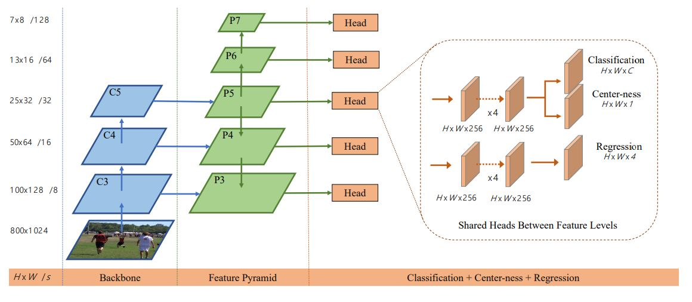

# Fully Convolutional One-Stage Object Detection (FCOS)
This repository contains my implementation of the Fully Convolutional One-Stage Object Detection([FCOS](https://arxiv.org/abs/1904.01355)) object detection architecture. Please note that the codes in this repository is still work-in-progress.

## Architecture of FCOS
As shown in Fig. 1, the FCOS architecture includes the Feature Pyramid Network (FPN) but adds separate classification and regression heads.

Fig. 1: FCOS Architecture (as shown in the [FCOS](https://arxiv.org/abs/1904.01355) paper).

## Losses
The original paper uses Binary Cross Entropy (BCE) for as the loss function for centerness and Intersection over Union (IoU) Loss for the bounding boxes. In the code, the Smooth L1-loss is implemented instead of IoU loss and BCE as it appeared to stabilize the training. However, it does support IoU loss (uncomment the relevant lines in the code). 
