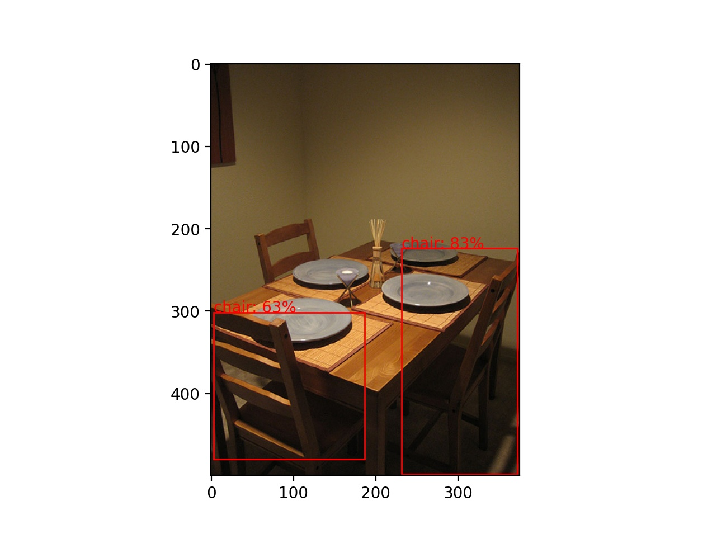
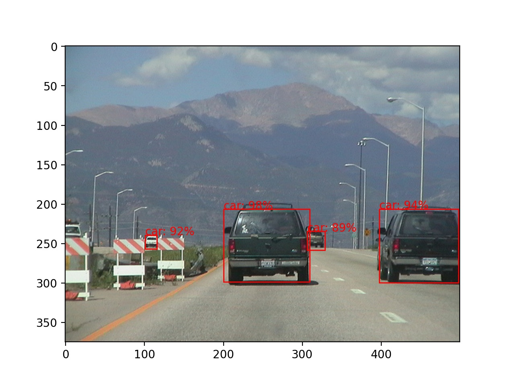
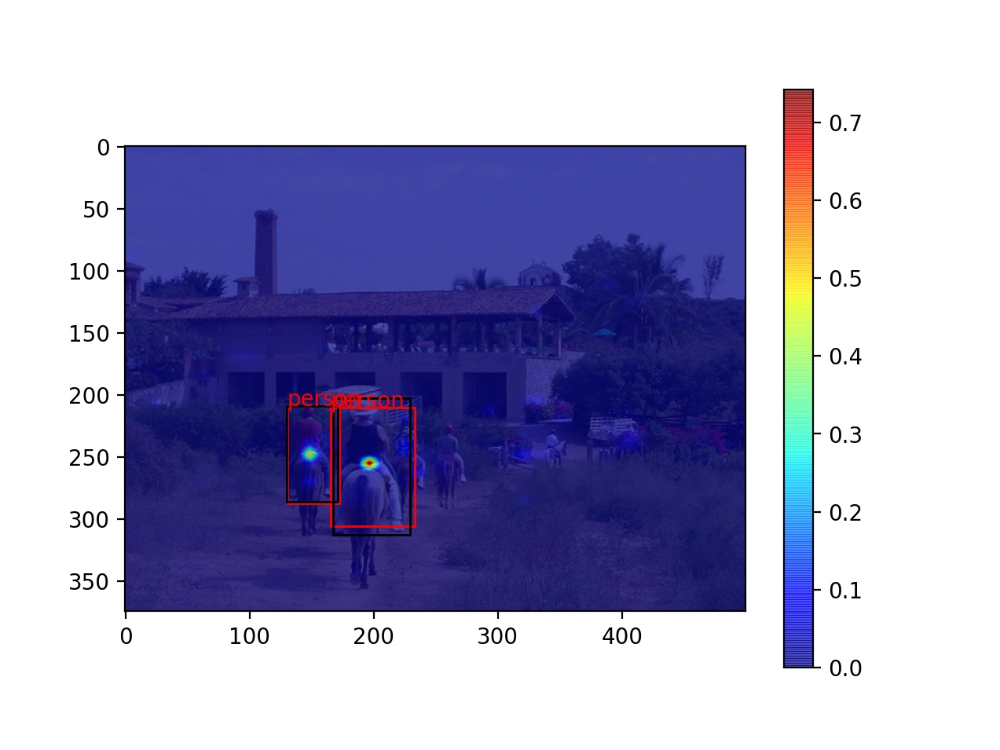
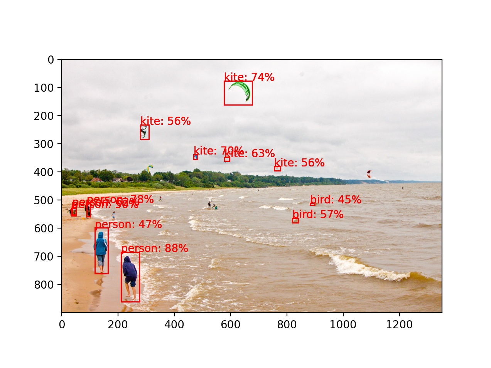
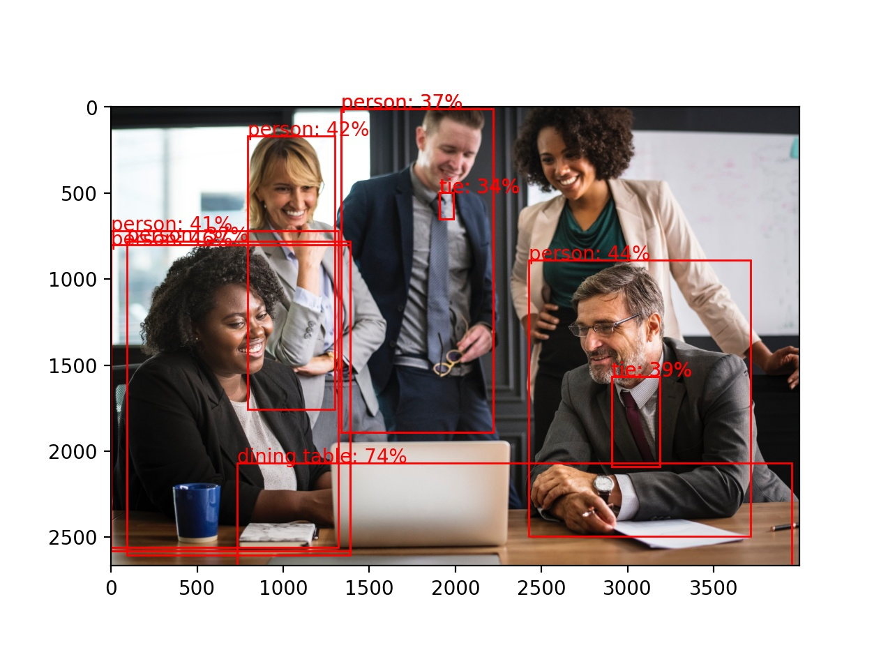
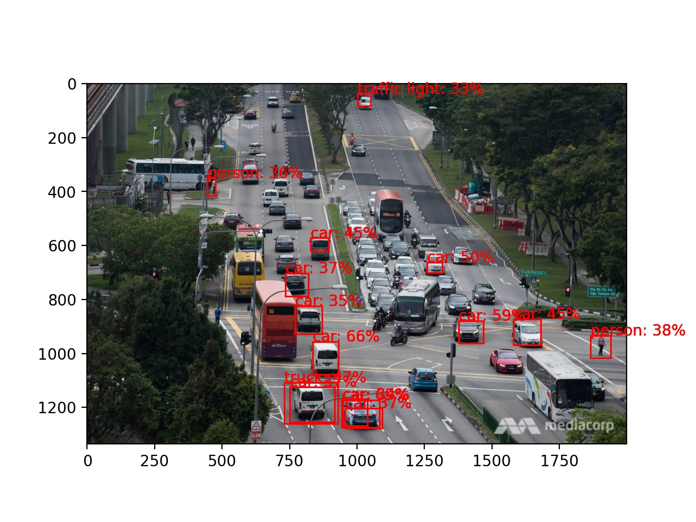

# Custom Object Detection

This repository contains my experiments with custom object detection models whose weights are trained from scratch, that is to say, no pre-trained backbone model is used. This model is inspired from [EfficientDet](https://arxiv.org/abs/1911.09070), where the object detection model's weights were trained from scratch, and [FCOS](https://arxiv.org/abs/1904.01355), which is an anchor-free model. The model explored is relatively small, utilising Feature Pyramid Networks, and trained on the [VOC 2012](http://host.robots.ox.ac.uk/pascal/VOC/voc2012/) and the [COCO](https://cocodataset.org/#home) dataset. 

To run the object detection, first run
```
python process_voc_object_detection.py
```
followed by
```
python voc_object_detection.py
```
to train the object detector. For the COCO object detection, due to the large size, a more optimal method to feed the images is used. Hence, please run
```
python process_voc_object_detection.py
```
followed by
```
python format_COCO_annotations.py
```
and finally
```
python coco_object_detection.py
```
to train the object detection algorithm using the COCO dataset. The COCO object detection model has approximately 9M parameters. The NMS algorithm in `coco_detect.py` is modified from [here](https://github.com/klauspa/Yolov4-tensorflow).

## Hardware
The models are trained on an Nvidia P1000 4GB Graphics card. As a result, the gradients are manually accumulated in sub-batches of 12 with a total batch size of 96. The input image is resized to 320 by 320 pixels to allow it to be trained with a lower-end GPU.

## Experiment with Numerically Stable Focal Loss Function
There is also an experimentation with `focal_loss` in `tf_object_detection.py` to stabilise the Focal Loss in a similar manner to the [sigmoid loss](https://www.tensorflow.org/api_docs/python/tf/nn/sigmoid_cross_entropy_with_logits). Let the labels be `z` and the logits be `x`. Since the Focal Loss is given by
```
Focal Loss 
= z * a * power(1 - sigmoid(x), gamma) * -log(sigmoid(x)) +\
  (1 - z) * (1 - a) * power(sigmoid(x), gamma) * -log(1 - sigmoid(x))
= z * a * power(1 - sigmoid(x), gamma) * -log(1 / (1 + exp(-x))) +\
  (1 - z) * (1 - a) * power(sigmoid(x), gamma) * -log(exp(-x) / (1 + exp(-x)))
= z * a * power(1 - sigmoid(x), gamma) * log(1 + exp(-x)) +\
  (1 - z) * (1 - a) * power(sigmoid(x), gamma) * (-log(exp(-x)) + log(1 + exp(-x)))
= z * a * power(1 - sigmoid(x), gamma) * log(1 + exp(-x)) +\
  (1 - z) * (1 - a) * power(sigmoid(x), gamma) * (x + log(1 + exp(-x))),
```
we can observe that the loss is numerically stable for `x > 0`. For `x < 0`, the Focal Loss can be expressed as
```
Focal Loss
= z * a * log(1 + exp(-x)) * power(1 - sigmoid(x), gamma) +\
  (1 - z) * (1 - a) * power(sigmoid(x), gamma) * (log(exp(x)) + log(1 + exp(-x)))
= z * a * log(1 + exp(-x)) * power(1 - sigmoid(x), gamma) +\
  (1 - z) * (1 - a) * power(sigmoid(x), gamma) * log(1 + exp(x))
= z * a * x * power(1 - sigmoid(x), gamma) -\
  z * a * x * power(1 - sigmoid(x), gamma) +\
  z * a * log(1 + exp(-x)) * power(1 - sigmoid(x), gamma) +\
  (1 - z) * (1 - a) * power(sigmoid(x), gamma) * log(1 + exp(x))
= z * a * log(exp(x)) * power(1 - sigmoid(x), gamma) -\
  z * a * x * power(1 - sigmoid(x), gamma) +\
  z * a * log(1 + exp(-x)) * power(1 - sigmoid(x), gamma) +\
  (1 - z) * (1 - a) * power(sigmoid(x), gamma) * log(1 + exp(x))
= z * a * log(1 + exp(x)) * power(1 - sigmoid(x), gamma) +\
  (1 - z) * (1 - a) * power(sigmoid(x), gamma) * log(1 + exp(x)) - z * a * x * power(1 - sigmoid(x), gamma).
```
Therefore, our Focal Loss is implemented as follows:
```
Focal Loss
= z * a * power(1 - sigmoid(x), gamma) * log(1 + exp(-abs(x))) +\
  (1 - z) * (1 - a) * power(sigmoid(x), gamma) * log(1 + exp(-abs(x))) +\
  (1 - z) * (1 - a) * power(sigmoid(x), gamma) * max(x, 0) - z * a * min(x, 0) * power(1 - sigmoid(x), gamma).
```
The algorithm looked Some detection results are shown below.

## VOC Results
The results of the object detection model trained using the VOC dataset is shown in this section (to be updated again).
Sample Result 1 | Sample Result 2 | Heatmap
:-------------------------:|:-------------------------:|:-------------------------:
 |  | 

Please note that the black boxes indicate ground truth while red boxes indicate the predicted bounding box in the detection desult with the heatmap.

## COCO Results
The results of the object detection model trained using the COCO dataset is shown in this section. The model's ability to identify the object as the training progress is shown in the animated GIF below.


The model is tested on a few test images as shown below.
Kite | Meeting | Traffic
:-------------------------:|:-------------------------:|:-------------------------:
 |  | 

As can be observed, the detection rate in dense images is not particularly good. This is likely to be due to the image being resized to 320 by 320 pixels. 
