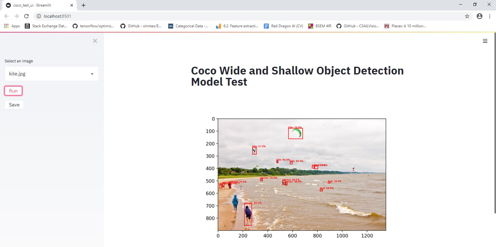

# Computer Vision Modules

This repository contains my Computer Vision codes and modules. It consists of the following:
1. Lite-Object-Detection
2. SpineNet-Object-Detection (Work-in-progress)

User Interface Prototype (Work-in-progress):

To run the UI, use `streamlit run coco_test_ui.py`.
