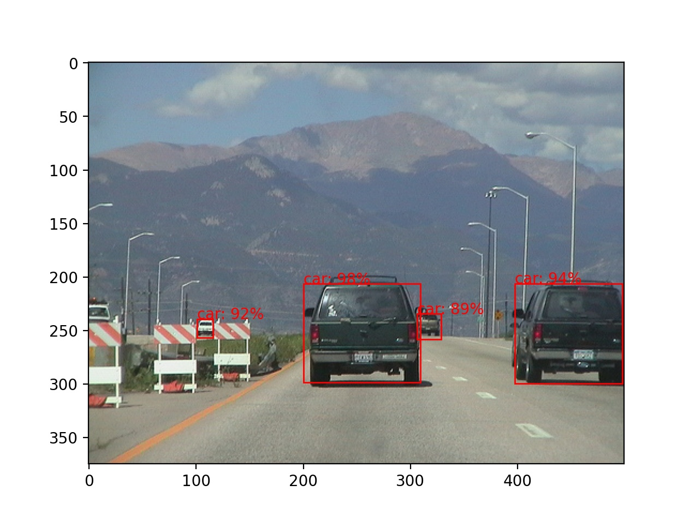
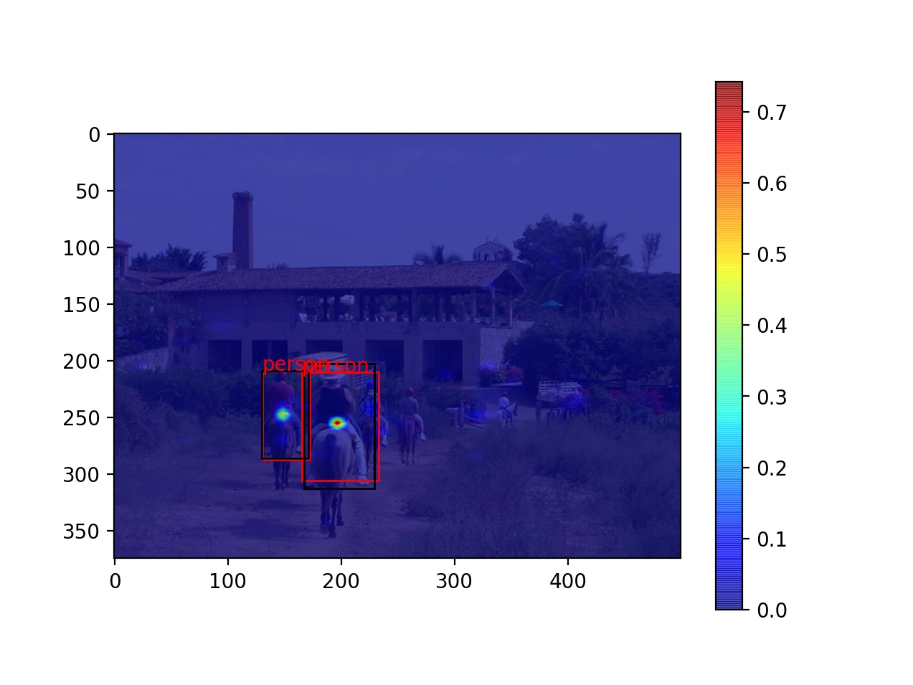

# Custom Object Detection

This repository contains my experiments with custom object detection models whose weights are trained from scratch, that is to say, no pre-trained backbone model is used. The model is relatively small and trained on the [VOC 2012](http://host.robots.ox.ac.uk/pascal/VOC/voc2012/) dataset. To run the object detection, first run
```
python process_voc_object_detection.py
```
followed by
```
python voc_object_detection.py
```
to train the object detector. 

There is also an experimentation with `focal_loss` in `tf_object_detection.py` to stabilise the Focal Loss in a similar manner to the [sigmoid loss](https://www.tensorflow.org/api_docs/python/tf/nn/sigmoid_cross_entropy_with_logits). Since the Focal Loss is given by
```
Focal Loss 
= z * a * power(1 - sigmoid(x), gamma) * -log(sigmoid(x)) +\
  (1 - z) * (1 - a) * power(sigmoid(x), gamma) * -log(1 - sigmoid(x))
= z * a * power(1 - sigmoid(x), gamma) * -log(1 / (1 + exp(-x))) +\
  (1 - z) * (1 - a) * power(sigmoid(x), gamma) * -log(exp(-x) / (1 + exp(-x)))
= z * a * power(1 - sigmoid(x), gamma) * log(1 + exp(-x)) +\
  (1 - z) * (1 - a) * power(sigmoid(x), gamma) * (-log(exp(-x)) + log(1 + exp(-x)))
= z * a * power(1 - sigmoid(x), gamma) * log(1 + exp(-x)) +\
  (1 - z) * (1 - a) * power(sigmoid(x), gamma) * (x + log(1 + exp(-x))),
```
we can observe that the loss is numerically stable for `x > 0`. For `x < 0`, the Focal Loss can be expressed as
```
Focal Loss
= z * a * log(1 + exp(-x)) * power(1 - sigmoid(x), gamma) +\
  (1 - z) * (1 - a) * power(sigmoid(x), gamma) * (log(exp(x)) + log(1 + exp(-x)))
= z * a * log(1 + exp(-x)) * power(1 - sigmoid(x), gamma) +\
  (1 - z) * (1 - a) * power(sigmoid(x), gamma) * log(1 + exp(x))
= z * a * x * power(1 - sigmoid(x), gamma) -\
  z * a * x * power(1 - sigmoid(x), gamma) +\
  z * a * log(1 + exp(-x)) * power(1 - sigmoid(x), gamma) +\
  (1 - z) * (1 - a) * power(sigmoid(x), gamma) * log(1 + exp(x))
= z * a * log(exp(x)) * power(1 - sigmoid(x), gamma) -\
  z * a * x * power(1 - sigmoid(x), gamma) +\
  z * a * log(1 + exp(-x)) * power(1 - sigmoid(x), gamma) +\
  (1 - z) * (1 - a) * power(sigmoid(x), gamma) * log(1 + exp(x))
= z * a * log(1 + exp(x)) * power(1 - sigmoid(x), gamma) +\
  (1 - z) * (1 - a) * power(sigmoid(x), gamma) * log(1 + exp(x)) - z * a * x * power(1 - sigmoid(x), gamma).
```
Therefore, our Focal Loss is implemented as follows:
```
Focal Loss
= z * a * power(1 - sigmoid(x), gamma) * log(1 + exp(-abs(x))) +\
  (1 - z) * (1 - a) * power(sigmoid(x), gamma) * log(1 + exp(-abs(x))) +\
  (1 - z) * (1 - a) * power(sigmoid(x), gamma) * max(x, 0) - z * a * min(x, 0) * power(1 - sigmoid(x), gamma).
```
Some detection results are shown below.

Sample Result 1:


Sample Result 2:


Detection Result with Heatmap (black boxes indicate ground truth while red boxes indicate the predicted bounding box):



